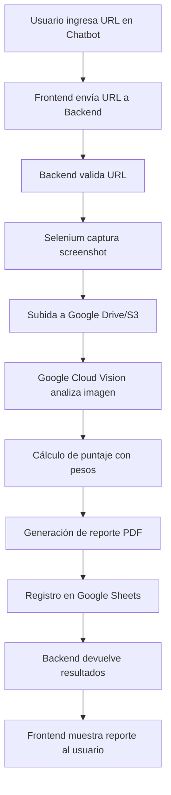

# Diseño de Arquitectura: Herramienta de Evaluación y Reporte de Diseño Web

## Visión General
El sistema es una aplicación web que evalúa el diseño de sitios web mediante captura de screenshots, análisis automatizado y generación de reportes. Utiliza un stack de Python con FastAPI para el backend, React para el frontend de chatbot, Selenium para screenshots, Google Cloud Vision para evaluación de diseño, y Google Sheets para registros.

## Componentes Principales

### 1. Frontend (React)
- Interfaz de chatbot para entrada de URL
- Visualización de resultados (puntaje, reporte, recomendaciones)
- Comunicación con backend vía API REST

### 2. Backend (FastAPI)
- Validación de URLs
- Orquestación del proceso de evaluación
- API endpoints para comunicación con frontend

### 3. Módulo de Captura (Selenium)
- Toma screenshots de alta calidad de páginas web
- Manejo de diferentes dispositivos/resoluciones

### 4. Almacenamiento en Nube (Google Drive/S3)
- Subida automática de screenshots
- Generación de enlaces públicos para acceso

### 5. Motor de Evaluación (Google Cloud Vision + Reglas)
- Análisis de tipografía, color y layout
- Cálculo de puntaje ponderado (0-100)

### 6. Generador de Reportes (PDF)
- Creación de reportes con screenshot, puntaje y recomendaciones
- Uso de bibliotecas como ReportLab o FPDF

### 7. Integración Google Sheets
- Registro automático de evaluaciones
- Almacenamiento de URL, timestamp, puntaje y resumen

## Flujo de Datos

## Pesos para Puntaje (Configurables)
- Tipografía: 25%
- Color: 25%
- Layout: 30%
- Usabilidad: 20%

## Tecnologías Específicas
- Backend: Python 3.9+, FastAPI, Uvicorn
- Frontend: React 18+, Axios para API calls
- Captura: Selenium WebDriver, ChromeDriver
- Análisis: Google Cloud Vision API
- Almacenamiento: Google Drive API o AWS S3
- Reportes: ReportLab para PDF
- Registros: Google Sheets API
- Base de datos: SQLite para desarrollo, PostgreSQL para producción (opcional)

## Consideraciones de Seguridad
- Validación de URLs para prevenir ataques
- Autenticación para Google APIs
- Manejo seguro de credenciales (variables de entorno)

## Escalabilidad
- Procesamiento asíncrono con Celery para evaluaciones pesadas
- Caché para resultados previos
- Rate limiting para APIs externas